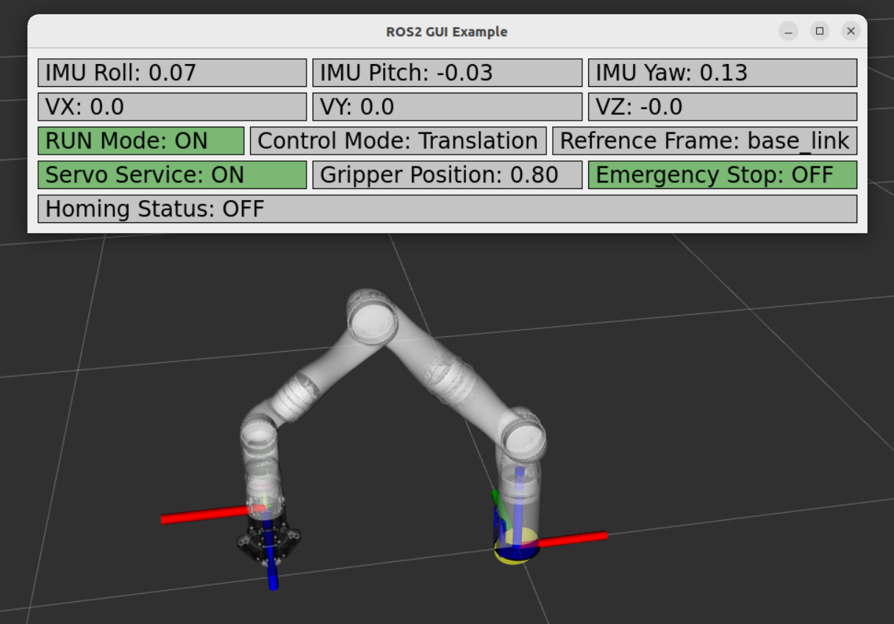

# Portfolio note

This is a standalone university/team project I worked on. The repository was imported as a clean single commit for resume and portfolio presentation.

# Teleop of Kinova Gen3 Arm using ROS2 Humble
### *Controlling a Kinova Gen3 Arm Using Move-IT Servo with ROS2 IMU Sensor Data*

---

## 📦 Installation Instructions

### 1. Clone the Repository

```bash
git clone https://github.com/samisaliveagain/kortex_imu_moveit_servo_gen3-portfolio.git

cd kortex_imu_moveit_servo_gen3-portfolio
```

### 2. Build the Docker Image

Run from the root folder:

```bash
bash docker_build.sh
```

This builds the image:

```
ros2-kortex:latest
```

---

### 3. Run the Docker Container

```bash
cd docker_run
bash docker_run.sh
```

This opens a ready-to-use ROS 2 Humble environment.

---

### 4. Source the environment
Inside the container:

```bash
source /opt/ros/humble/setup.bash
source /colcon_ws/install/setup.bash
```

---

# 🔷 Sensor Information

This project uses the following sensors:

1. **Rotary Encoder Sensor**
    - The rotary knob is used to switch between **3 Control Modes** -
        > TCP **Translational** Control (w.r.t. `base_link`).
        > TCP **Orientation** Control (w.r.t. `end_effector_link`).
        > **Gripper** open/close control.
    - The button is used in 2 modes -
        > Single press toggles between master **RUN** and master **OFF**.
        > Long press (> 1 sec) triggers **Homing** for the robotic arm. [Useful in near singularity conditions].

2. **IMU MPU6050**
    - The IMU sensor is used to calculate **Roll, Pitch, Yaw [RPY]** angles.
    - These angles are used by the control node as basis to calculate velocities **vx, vy and vz** respectively.
    - Based on **Control Mode** these velocities are used to generate **Twist Commands** for the moveit_servo controller.
    - The yaw is used to control opening and closing of gripper.

3. **IR sensor**
    - The IR sensor is used as an **Emergency Stop**.
    - No commands from IMU are accepted when the proximity of iR sensor is triggered.

---

# 🔷 Nodes and Packages Developed for Control

1. **arm_servoing:** 
    - This is the main controller node that accepts the sensor data from the topics `/wifi/imu` and `/wifi/enc`.
    - The encoder data is then used to define control modes. The IMU **RPY** data is used to calculate **vx, vy & vz**.
    - For Control mode: 0, the **vx, vy & vz** data is published to the linear argument of topic `/servo_node/delta_twist_cmds` for translation. In control mode 1: the data is passed to the angular argument of the same topic to control orientation.
    - The **vx** data is use to give position command to the action `/robotiq_gripper_controller/gripper_cmd` to open and close the gripper.

2. **moveit_servo:** 
    - [moveit2 package](https://github.com/moveit/moveit2.git) was cloned from the movit github repo and built in `overlay_ws` to enable `/moveit_servo` and it's complimentary services and topics.

3. **servo_rviz:**
    - The `gen3_servo_config.yaml` file contains the important parameters for the servo controller. It defines parameters like move_group_name, singularity_threshold, planning_frame, etc for our kenova gen3 robotic arm.
    - The `servo_rviz.launch.py` launches the rviz sim and all the nodes required to make the control pipeline work.

4. **wifi_sensor_bridge:**
    - This node accepts the sensor data from esp32 on udp port 5000 and pusblishes it to ROS topics `/wifi/imu` and `/wifi/enc`.

---

# 🔷 Launching servo_riz controller

The project controller can be launched using the following command:
```bash
ros2 launch servo_rviz servo_rviz.launch.py bind_ip:=X.X.X.X port:=5000
```

Arguments:
- `bind_ip:=X.X.X.X`         [IP Port: Ip to create the UDP socket]
- `port:=5000`               [Port: Port for the udp socket]
- `launch_ui:=true\false`    [Default: true]

`launch_ui` option can be used to launch a basic PyQt5 GUI Application. The application displays IMU sensor data, directional velocities and control modes.



---

# 📘 End of README
